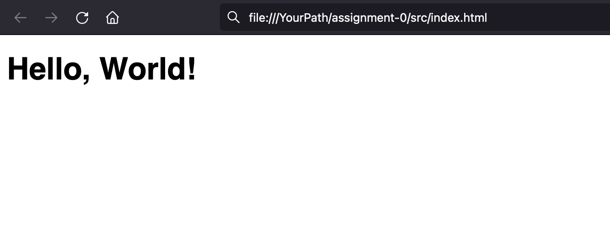
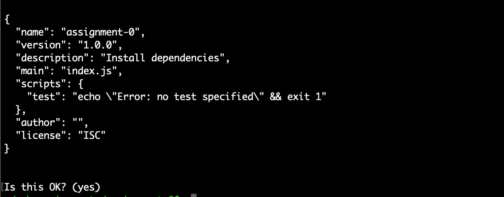
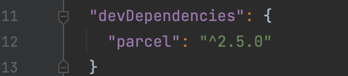
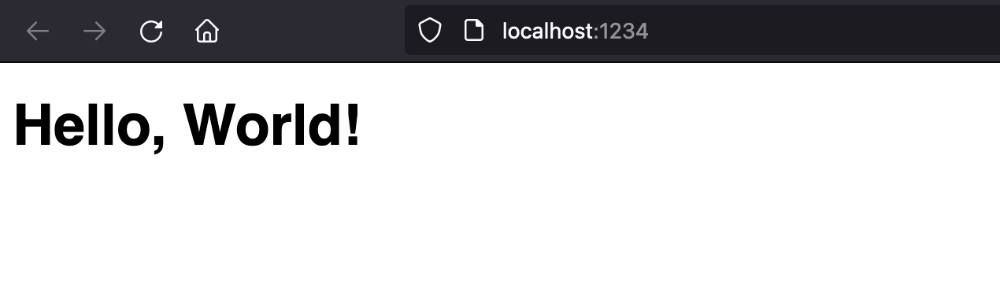

# Assignment 0 - Setting up environment

## Install required application

## Install Node js

We will install [Node.js®](https://nodejs.org/en/) Long Term Support (LTS) version.
If you already have Node.js® installed, make sure your version is 16.10 or higher.

1. Go to [Node.js®](https://nodejs.org/en/) website click [here](https://nodejs.org/en/).
2. Click on [LTS version](https://nodejs.org/dist/v16.15.0/node-v16.15.0.pkg).
3. Install node.

## Install Editor

Install any one of these. If you prefer any other editor that is fine as well.

### Install WebStorm IDE

We will use [WebStorm](https://www.jetbrains.com/webstorm/) as programming environment.
Check if you qualify for [free student License](https://www.jetbrains.com/shop/eform/students).

### Brackets

[Brackets](https://brackets.io/) editor is another good option.

### Visual Studio Code

[Visual Studio Code](https://code.visualstudio.com/) is good as well.

# Setup project structure

Open your command line application `Shall` etc.

1. Create a directory named `assignment-0`

```shell
mkdir assignment-0
```

2. Go to directory `assignment-0`

```shell
cd assignment-0
```

3. Create a directory named `src` and go inside it.

```shell
mkdir src
cd src
```

4. Create a file `index.html`

```shell
touch index.html
```

# Let us create our firs website

1. Open `assignment-0/src/index.html` file you have just created in code editor.

2. Copy the following into it

```html
<!doctype html>
<html lang="en">
<head>
    <meta charset="utf-8"/>
    <title>My First App</title>
</head>
<body>
<h1>Hello, World!</h1>
</body>
</html>
```

3. Save the file and just simple double-click on the file.
   It should open this file in the browser.
   You should see something like this.



4. Change `Hello, World!`, save and reload. You should see change.

# Make process automatic

### Create a Nodejs project

The above method is not good enough. Let us make it better. Create a node package.

Make sure you are in `assignment-0` directory and NOT IN `assignment-0/src`.

Run following command and keep hitting `enter`

```shell
npm init
```

Keep hitting enter till you see...



Enter again and you are done.

Now if you will see a file named `package.json` in `assignment-0` directory. We will lean about it in the future. I will
encourage you to read about it on [npmjs](https://docs.npmjs.com/cli/v7/configuring-npm/package-json) site.

### Install a development tool

We will use [Parceljs](https://parceljs.org/getting-started/webapp/) tool for development.

Make sure you are in `assignment-0` directory and NOT IN `assignment-0/src`.
Run following command...

```shell
npm install parcel --save-dev 
```

You will see that in your `package.json` file this section is added.



### Add start command to `package.json` file

Add this line to your `package.json` file

```json
    "start": "parcel src/index.html"
```

Now you `package.json` file should look like this.

```json
{
  "name": "assignment-0",
  "version": "1.0.0",
  "description": "",
  "main": "index.js",
  "scripts": {
    "test": "echo \"Error: no test specified\" && exit 1",
    "start": "parcel src/index.html"
  },
  "author": "",
  "license": "ISC",
  "devDependencies": {
    "parcel": "^2.5.0"
  }
}
```

### Let us run our application

Run following command while you are still in `assignment-0` directory.

```shell
npm run start
```

In the browser type the following

[http://localhost:1234](http://localhost:1234)

You should see



# You are all set

Now if you will make any changes to `assignment-0/src/index.html` file, automatically page in the browser will change.

# Well done
